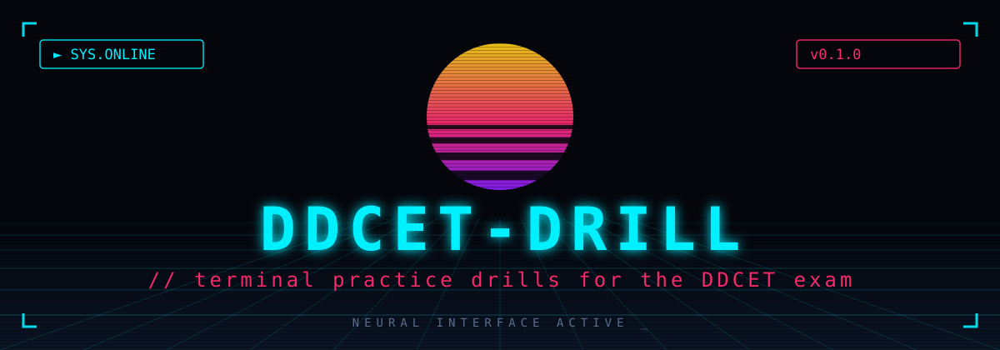

<p align="center">
  
</p>

<p align="center">
  
  
  
</p>

---

# ddcet-drill

> **Terminal practice drills for the DDCET exam** — Gujarat's diploma-to-degree
> engineering entrance. Practice by subject, run timed mocks, and track
> topic-wise accuracy. Uses the real DDCET marking scheme: **+2 correct,
> −0.5 wrong, 0 for Not attempted (E).**

Standard library only. No dependencies, no network, no accounts.

## Install

```bash
pip install .
```

## Usage

```bash
# Untimed drill: 10 physics questions, instant feedback
ddcet-drill practice --subject physics -n 10

# Timed mock: 20 questions, 30 minutes, subjects intermixed
ddcet-drill mock -n 20 --minutes 30

# Topic-wise accuracy across all your attempts
ddcet-drill stats

# What the question bank covers (and its health check)
ddcet-drill subjects
```

Attempts are logged to `~/.ddcet-drill/history.jsonl` (append-only), which
powers `stats`. Delete the file any time to reset.

## Question bank

Seeded with 49 questions across all 7 DDCET subjects, each with an
explanation. The bank lives in `src/ddcet_drill/data/questions.json` — add
more following the same schema (`id`, `subject`, `topic`, `stem`, `options`
× 4, `answer` index, `explanation`) and they are picked up automatically.

## Marking

Matches the DDCET paper: +2 for a correct answer, −0.5 for a wrong one,
0 for E (Not attempted). The mock report breaks your score down per subject
and lists every mistake with its explanation, so each attempt teaches.

## License

MIT — see [LICENSE](LICENSE).

---
<p align="center"><sub>// end of transmission _</sub></p>
